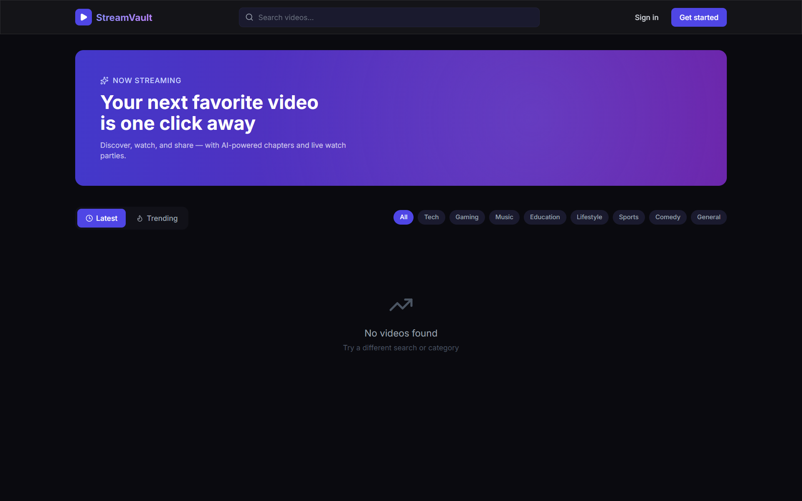
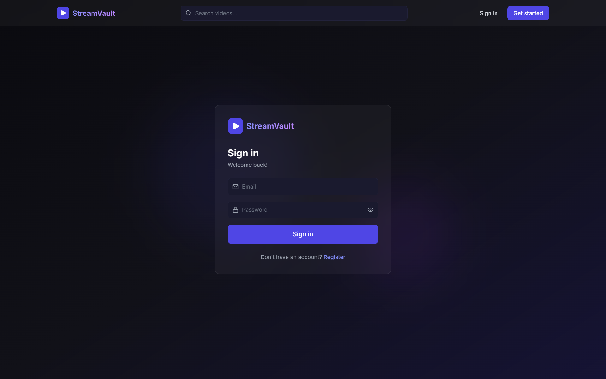
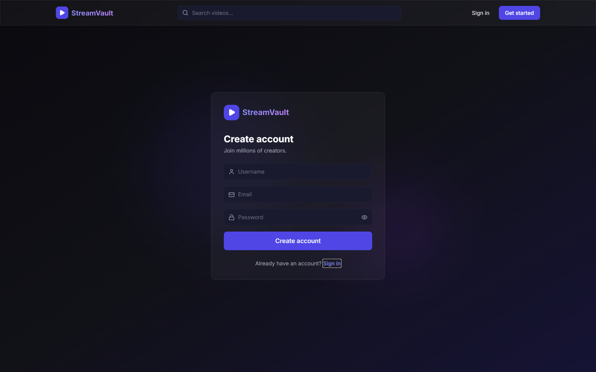
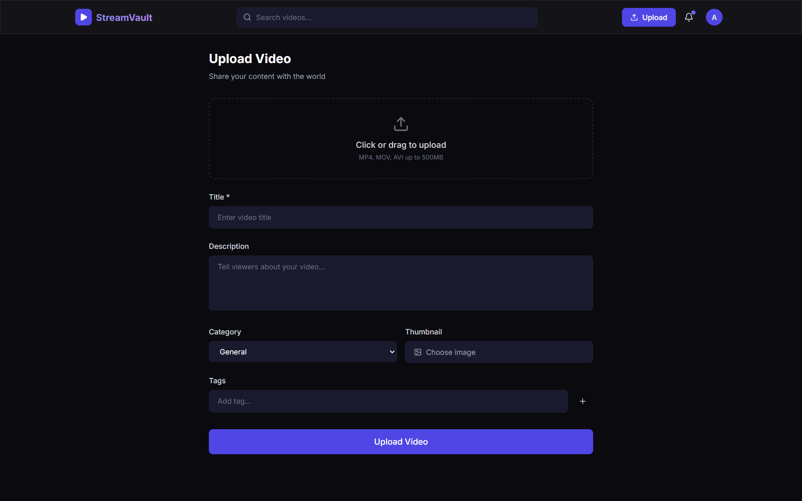

# StreamVault

A full-stack video streaming platform built with the MERN stack, featuring adaptive video delivery, real-time watch parties, and AI-powered content enhancement.

## Overview

StreamVault combines modern streaming capabilities with real-time collaboration features to deliver an engaging video consumption experience. The platform supports adaptive playback, synchronized viewing sessions, intelligent chapter generation, and scalable content management.






## Key Features

* Adaptive HLS video streaming with automatic quality adjustment
* Real-time watch parties with synchronized playback
* AI-generated video chapters powered by Claude AI
* Secure authentication and authorization using JWT
* Cloud-based video storage and delivery via Cloudinary
* Real-time chat and interaction using Socket.io
* Responsive and modern user interface
* Creator profiles and content management

## Technology Stack

### Frontend

* React 18
* Vite
* Tailwind CSS
* Framer Motion
* Zustand
* TanStack Query

### Backend

* Node.js
* Express.js
* MongoDB
* Mongoose
* Socket.io

### External Services

* Cloudinary
* Anthropic Claude API

## Project Structure
```
StreamVault/
│
├── client/
│   ├── public/
│   ├── src/
│   │   ├── components/
│   │   ├── pages/
│   │   ├── store/
│   │   ├── hooks/
│   │   ├── lib/
│   │   └── assets/
│   ├── package.json
│   └── vite.config.js
│
├── server/
│   ├── src/
│   │   ├── config/
│   │   ├── models/
│   │   ├── routes/
│   │   ├── middleware/
│   │   ├── socket/
│   │   ├── services/
│   │   └── index.js
│   ├── .env.example
│   └── package.json
│
├── images/
├── .gitignore
├── LICENSE
└── README.md
```

## Installation

### Clone Repository

```bash
git clone https://github.com/samoff04/StreamVault.git
cd StreamVault
```

### Backend Setup

```bash
cd server
npm install
npm run dev
```

### Frontend Setup

```bash
cd client
npm install
npm run dev
```

## Environment Variables

Create a `.env` file inside the server directory.

```env
PORT=5000
MONGO_URI=your_mongodb_connection_string
JWT_SECRET=your_jwt_secret
CLOUDINARY_CLOUD_NAME=your_cloud_name
CLOUDINARY_API_KEY=your_api_key
CLOUDINARY_API_SECRET=your_api_secret
ANTHROPIC_API_KEY=your_api_key
CLIENT_URL=http://localhost:5173
```

## Core Capabilities

* Video Upload and Management
* Adaptive Streaming
* Live Watch Parties
* Real-Time Messaging
* AI Smart Chapters
* User Authentication
* Creator Profiles
* Subscriber System
* Video Analytics

## Future Enhancements

* Recommendation Engine
* Advanced Analytics Dashboard
* Live Streaming Support
* Multi-language Subtitles
* Content Moderation Pipeline

## License

This project is licensed under the MIT License.

## Author

Samarth Varshney